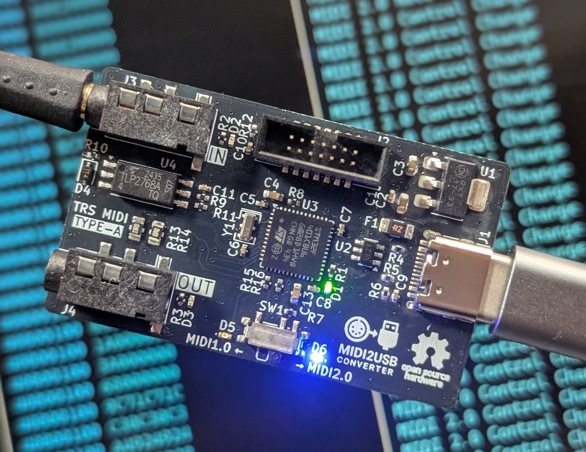
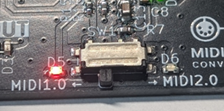
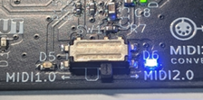

# 🎹 MIDI2USB Converter

<p align="center">
  
</p>

<p align="center">
  <a href="https://github.com/collet-instruments/MIDI2USB-Converter/actions/workflows/ci.yml"></a>
  <a href="https://github.com/collet-instruments/MIDI2USB-Converter/actions/workflows/code-quality.yml"></a>
  <a href="https://opensource.org/licenses/MIT"></a>
  
  
  
  
  
</p>

<p align="center">
  <strong>STM32F401-based USB MIDI converter supporting both MIDI 1.0 and MIDI 2.0 protocols.</strong>
</p>

## ✨ Features
- 🎵 **Dual Protocol Support**: MIDI 1.0 and MIDI 2.0 protocols
- 🔌 **USB Device Classes**: 
  - MIDI 1.0: Standard USB MIDI Class
  - MIDI 2.0: USB MIDI 2.0 Class with UMP support
- 🔄 **Dynamic Mode Switching**: Automatic detection based on SETUP switch
- 📦 **UMP (Universal MIDI Packet)**: Full support for MIDI 2.0 messaging
- 🔍 **MIDI-CI**: MIDI-CI v1.2 support
- 💡 **Visual Feedback**: LED status indicators
  - Red LED: USB MIDI 1.0 mode indicator
  - Blue LED: USB MIDI 2.0 mode indicator
- ⚡ **Real-time OS**: FreeRTOS-based multitasking
- 🔗 **UART Bridge**: Hardware TRS MIDI Type-A (3.5mm jack) interface support

## 📖 Usage

### Using USB MIDI1.0 Mode

  

- Switch SETUP (SW1) to MIDI1.0 and connect the USB Type-C port (J1) to a USB host
- The red LED (D5) will light up
- MIDI packets received at the MIDI IN port (J3) will be sent to the USB host
- Similarly, MIDI packets sent from the USB host will be output to the MIDI OUT port (J4)
- Data transfer status can be monitored via indicator LEDs (D2, D3) for both MIDI IN and MIDI OUT ports

### Using USB MIDI2.0 Mode

  

- Switch SETUP (SW1) to MIDI2.0 and connect the USB Type-C port (J1) to a USB host
- The blue LED (D6) will light up
- MIDI packets (MIDI1.0 byte stream) received at the MIDI IN port (J3) are converted to USB MIDI2.0 UMP (Universal MIDI Packet) and sent to the USB host
  - At this time, MIDI1.0 Voice Messages are extended to MIDI2.0 Protocol (UMP Message Type 4)
  - Similarly, MIDI2.0 UMP sent from the USB host is converted to MIDI1.0 byte stream and output to the MIDI OUT port (J4)
    - Since MIDI2.0 Protocol sent from the USB host is converted to MIDI1.0 Protocol, some data may be lost
- Data transfer status can be monitored via indicator LEDs (D2, D3) for both MIDI IN and MIDI OUT ports
- Some operating systems do not support USB MIDI2.0 drivers, in which case MIDI2.0 mode may not be available. Please use MIDI1.0 mode in such cases.

## 🔄 Protocol Conversion Rules

### MIDI 1.0 → MIDI 2.0 Conversion
The converter performs a 2-stage conversion process:
1. **Stage 1**: MIDI 1.0 byte stream → UMP (MIDI 1.0 Protocol)
2. **Stage 2**: UMP (MIDI 1.0 Protocol) → UMP (MIDI 2.0 Protocol)

**Key transformations**:
- **Resolution Enhancement**: 7-bit values are scaled up to 16-bit or 32-bit
  - Note velocity: 7-bit → 16-bit (e.g., 127 → ~65024)
  - Control Change values: 7-bit → 32-bit
  - Pitch Bend: 14-bit → 32-bit
- **Message Type**: Voice Messages are upgraded to UMP Message Type 4 (MIDI 2.0 Protocol)

### MIDI 2.0 → MIDI 1.0 Conversion
Direct conversion from UMP to MIDI 1.0 byte stream:

**Key transformations**:
- **Resolution Reduction**: High-resolution values are scaled down
  - Control values: 32-bit → 7-bit
- **Special handling for Note On velocity 0**:
  - In MIDI 2.0, Note On with velocity 0 remains a Note On
  - During conversion, velocity 0 is changed to 1 to prevent unintended Note Off behavior in MIDI 1.0
- **Data Loss**: MIDI 2.0-specific features (extended CC, per-note controllers) cannot be represented in MIDI 1.0

### Conversion Examples
- **MIDI 1.0 Note On**: `90 3C 64` (Ch1, Middle C, Velocity 100)
  → **MIDI 2.0 UMP**: `40902C00 32800000` (Velocity ≈ 51200)
  
- **MIDI 2.0 Note On**: Velocity 32768 (50% intensity)
  → **MIDI 1.0**: `90 3C 40` (Velocity 64, precision reduced)

## ⚠️ Caution

- The IN/OUT terminals of this product are **TRS MIDI Type-A only**. Do not use other types of cables.  
- Make sure not to confuse IN and OUT connections. Incorrect wiring may cause reverse current and damage your equipment.  
- This product is designed for **USB Type-C 5V power supply only**. Do not apply any other voltage.  
- The product may be damaged by static electricity. Please handle with proper ESD precautions.  
- Modifications or improper soldering may cause malfunction or accidents.  
- Do not use in environments with high temperature, high humidity, direct sunlight, or condensation.  
- Compatibility with all MIDI devices is **not guaranteed**.  

## 📜 Disclaimer

- This product is provided for **electronic hobby, educational, and research purposes**.  
- It is **not a consumer-ready product** and has **not been certified** under any safety standards or regulations (such as **PSE, Radio Act certification, CE, UL**, etc.).  
- By purchasing and using this product, you agree to the following terms:

### Use at Your Own Risk
- We accept no responsibility for any damage to equipment, personal injury, fire, data loss, or any other loss or accident resulting from the use of this product.

### Limitations of Use
- Do not use this product in industrial equipment, medical devices, safety systems, or any other applications where human life or property may be at risk.  
- Continuous long-term operation or use under heavy loads is not intended.

### Modification and Connections
- We are not responsible for any malfunction or damage caused by modification of this product or connection to unintended devices.

### Returns and Warranty
- If a manufacturing defect is confirmed, we will provide a replacement or refund.  
- No other warranties or guarantees are offered.

## ⚙️ Modification and Collaboration

- This product is provided as **open hardware**.  
  You are free to modify, reuse, or build upon the circuit and firmware.  
  However, **we cannot guarantee the operation or safety of modified versions**.  

- We welcome contributions from developers and users who wish to improve the design.  
  Please feel free to share feedback, modifications, or enhancement ideas.  

## 🛠️ Build Requirements

- ARM GCC toolchain (arm-none-eabi-gcc)
- CMake (3.22 or later)
- Ninja build system
- Git (for submodules)

## 📥 Getting Started

### Clone the Repository

```bash
git clone --recursive https://github.com/collet-instruments/MIDI2USB-Converter.git
cd MIDI2USB-Converter

# If you already cloned without --recursive, initialize submodules
git submodule init
git submodule update
```
### IDE Integration

**VS Code**: Use CMake extension for building and debugging with ST-Link.

- [STM32 VS Code extension](https://www.st.com/content/st_com/ja/campaigns/stm32-vs-code-extension-z11.html) makes setup easy.

## 🔨 Building

### Using CMake

```bash
# Configure the project
cmake --preset Debug

# Build the firmware
cmake --build --preset Debug

# The output files will be in build/Debug/
```
### Build Configurations

The project supports multiple build configurations:

- **Debug**: Development build with debug symbols (default)
- **Release**: Optimized build for production (-O2 optimization)
- **RelWithDebInfo**: Release build with debug info
- **MinSizeRel**: Size-optimized build (-Os optimization)

## 🧪 Testing

The project includes a comprehensive unit test suite using Unity framework.

### Running Tests

```bash
# Run all tests
cd test
make test

# Run specific test
make test-mode_manager

# Run tests with coverage
make clean
make COVERAGE=1
make test
```

## ✅ Code Quality

### Code Formatting

The project uses clang-format for code formatting. Configuration is in `.clang-format`.

```bash
# Format code
clang-format -i Core/Src/*.c Core/Inc/*.h

# Check formatting without modifying files
clang-format --dry-run --Werror Core/Src/*.c Core/Inc/*.h
```

### Static Analysis

```bash
# Run cppcheck
cppcheck --enable=warning,style,performance,portability \
  -I Core/Inc \
  Core/Src/
```

### CI/CD

GitHub Actions automatically runs on every push and pull request:

#### Workflows:
- **ci.yml**: Main CI pipeline
  - Builds STM32 firmware  
  - Runs all unit tests
  - Uploads firmware artifacts
  
- **code-quality.yml**: Code quality checks
  - Static analysis with cppcheck
  - Code formatting verification with clang-format
  
- **release.yml**: Automated releases
  - Triggers on version tags (v*)
  - Creates GitHub releases with firmware binaries

## 📁 Project Structure

```
├── Core/               # Application source code
├── Drivers/            # STM32 HAL and CMSIS drivers
├── submodules/         # External dependencies
│   ├── FreeRTOS-Kernel/
│   ├── tinyusb/
│   ├── AM_MIDI2.0Lib/
│   ├── tusb_ump/
│   └── Unity/
├── test/               # Unit tests (Unity framework)
│   ├── src/            # Test source files
│   ├── mock/           # Mock implementations
│   └── include/        # Test headers
├── ci/                 # CI/CD scripts
└── .github/            # CI/CD workflows
```

## 📦 Submodules

This project uses the following Git submodules:

| Submodule | Repository URL | Description |
|-----------|---------------|-------------|
| **FreeRTOS-Kernel** | https://github.com/FreeRTOS/FreeRTOS-Kernel.git | FreeRTOS kernel files only |
| **tinyusb** | https://github.com/hathach/tinyusb.git | An open source cross-platform USB stack for embedded system |
| **tusb_ump** | https://github.com/midi2-dev/tusb_ump | USB MIDI 2.0 tinyUSB Device driver with backwards compatibility to USB MIDI 1.0 |
| **AM_MIDI2.0Lib** | https://github.com/midi2-dev/AM_MIDI2.0Lib | A MIDI 2.0 C++ Library |
| **Unity** | https://github.com/ThrowTheSwitch/Unity.git | Simple unit testing for C |

## 🔧 Hardware

### 🎛️ Microcontroller
- **MCU**: STM32F401CBU6 (ARM Cortex-M4, 84MHz)
- **Flash**: 256KB
- **RAM**: 64KB

### 🔌 Interfaces
- **USB**: Full-Speed USB 2.0 (12Mbps)
- **UART**: MIDI serial interface (31.25 kbaud)
  - TX: PA2 (USART2_TX)
  - RX: PA3 (USART2_RX)
- **DEBUG**: ST-Link support (J2 connector)

### 📍 GPIO Pins
- **Mode Selection**: PA5 (SETUP pin)
  - High: USB MIDI 2.0 mode
  - Low: USB MIDI 1.0 mode
- **LEDs**:
  - M1LED: PA4 - USB MIDI 1.0 mode indicator
  - M2LED: PA6 - USB MIDI 2.0 mode indicator

### ⚡ Power
- Powered via USB (5V)
- 3.3V internal operation

## 💻 Development

### Running Tests Locally
```bash
# Quick test before pushing
./ci/test-ci-locally.sh

# Install optional CI tools
./ci/install-ci-tools.sh
```

### Debugging

1. **VS Code**: Use CMake extension and ST-Link for debugging
2. **OpenOCD**: Manual debugging with GDB

- Connect the J2 connector (NRST, SYS_SWCLK, SYS_SWDIO) to ST-Link for debugging. USART1 is also available for printf debugging.

## 🤝 Contributing

We welcome contributions! Please see [CONTRIBUTING.md](CONTRIBUTING.md) for details on:
- How to submit issues
- How to submit pull requests
- Code style guidelines
- Development setup

## 📜 Code of Conduct

This project adheres to a Code of Conduct. By participating, you are expected to uphold this code. Please see [CODE_OF_CONDUCT.md](CODE_OF_CONDUCT.md) for details.

## 📄 License

This project is licensed under the MIT License - see the [LICENSE](LICENSE) file for details.

**Hardware Design**: All hardware design files including schematics, PCB layouts, and manufacturing files in the `hardware/` directory are also covered under the same MIT License.

### Third-party Licenses

This project uses the following open-source libraries:
- **FreeRTOS-Kernel**: MIT License
- **TinyUSB**: MIT License
- **AM_MIDI2.0Lib**: MIT License
- **Unity Test Framework**: MIT License
- **STM32 HAL Drivers**: BSD 3-Clause License (STMicroelectronics)

## 👥 Authors and Acknowledgments

- USB MIDI 2.0 implementation based on TinyUSB and AM_MIDI2.0Lib
- STM32 HAL drivers by STMicroelectronics
- Special thanks to all contributors

## 💬 Support

For questions and support:
- Open an issue on GitHub
- Check existing issues and discussions
- See documentation in the repository

## 📝 Copyright

Copyright © 2025 Collet Instruments. All rights reserved.